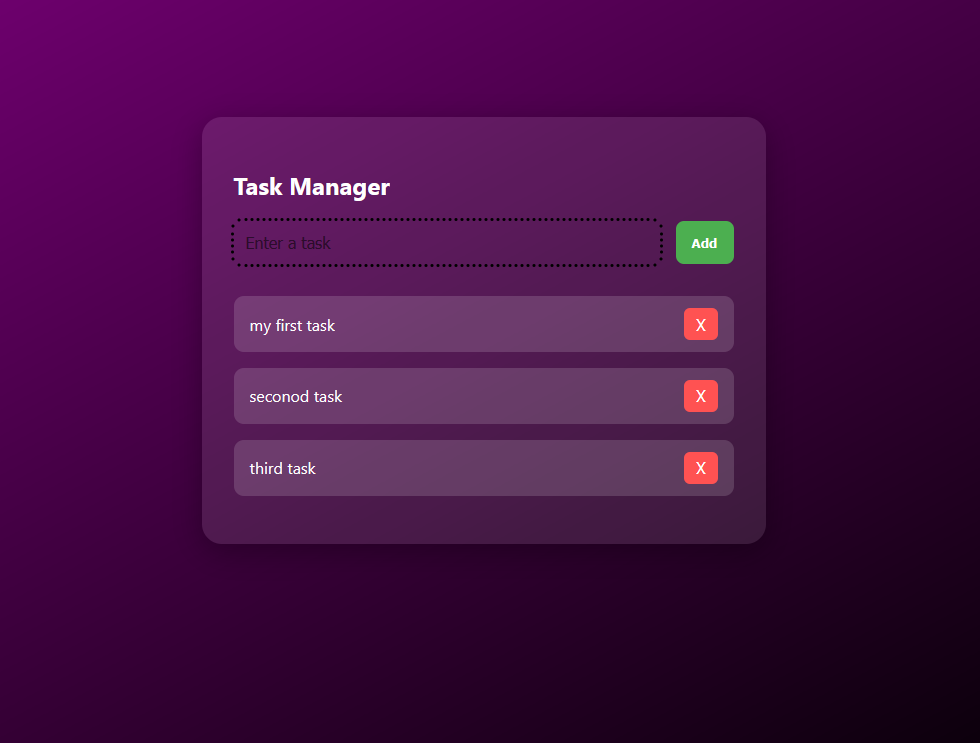

# 📝 Task Manager App

A beautifully styled and responsive **Task Manager** built using **React** (Frontend), **Node.js** (Backend ready for future integration), and modern **CSS**. The app lets users add and delete tasks in a clean UI with animations and a flexible layout.

---

## 🎯 Features

- 🎨 Clean card-based UI with gradient background
- 🧠 State-managed task list using React hooks
- ⚡ Smooth animations and transitions
- 📱 Fully responsive layout for mobile and desktop
- ❌ Task deletion with a visually appealing button
- 🚀 Easy to integrate with a backend for data persistence

---

## 🛠️ Tech Stack

| Layer     | Technology  |
|-----------|-------------|
| Frontend  | React, JSX  |
| Styling   | CSS (flexbox,media queries) |
| Backend (optional/future) | Node.js, Express |

---

## 📷 UI Preview



> *Gradient background + center-aligned card with task list below*

---

## 🚀 Getting Started

### 1️⃣ Clone the repository
```bash
git clone https://github.com/your-username/task-manager.git
cd task-manager
### 2️⃣ Clone the repository
npm install
### 3️⃣ Start the development server
npm start

💡 Author
Nimal N


